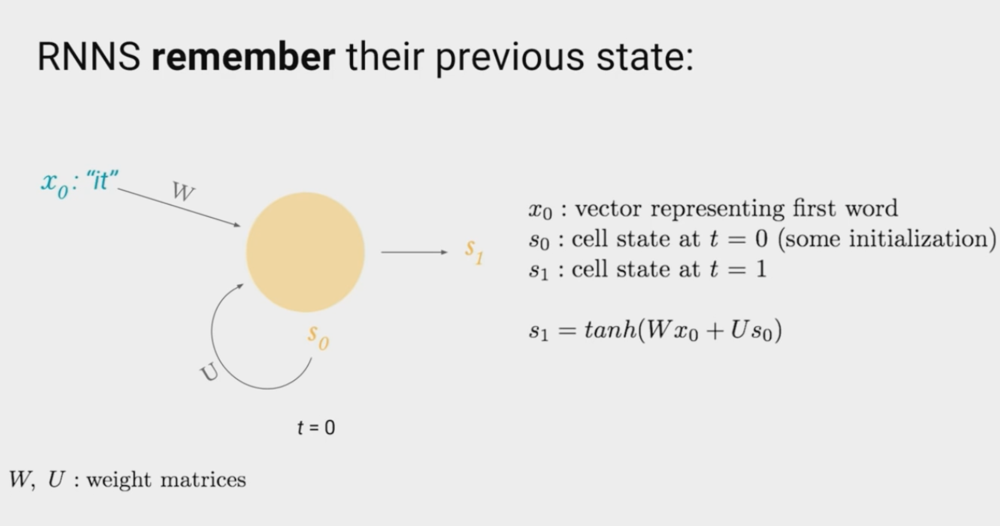
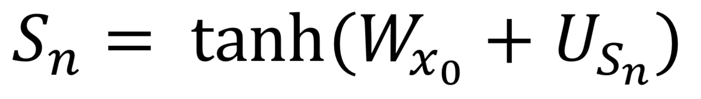
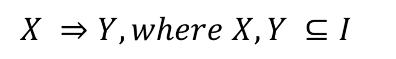
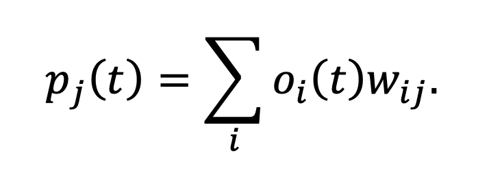

### The mathmatics of Learning 

The maths used throughout this project are rather complex, and thus require a certain amount of understanding of complex math principles. 

## Principles of Learning 

The algorithm is all based around a Recurrent Neural Network, busing Long short Term memory cells. 

As you can see, where an LSTM cell differs is that it takes not only its own input but the input of the cell before and after. AS shows in ths equation: 

## Accociation Rule Learning

Association Rule learning is a machine learning and Data mining learning technique, where rule-based machine learning is used to discover relations between data variables in large datasets.

This works by finding strong links between variables and creating rules based on them and then generating predictions based on these, a general rule can be expressed as below:

## MLP/multi-layer perceptron

A multi-layer perceptron is a feedforward style neural network where each layer contains a series of nodes which are nonlinear activated neurons. They have been used in similar problems before, specifically in regard to language recognition and classification problems using hidden Markov models.

This works by using a supervised learning method called backpropagation to calculate the gradient value to work out the weights on the neurons. The propagation equation works by calculating the input of `p_j` `(t)` to the next neuron `j` based on the outputs of the previous neuron `o_(i ) (t)`. This means that the input of the next neuron is the output of the previous neuron. Which is expressed in the following equation: 

A More complete write up can be found in my theisis:

**Application of Machine Learning Via a Neural Network to Game Theory & Guessing Logic**

