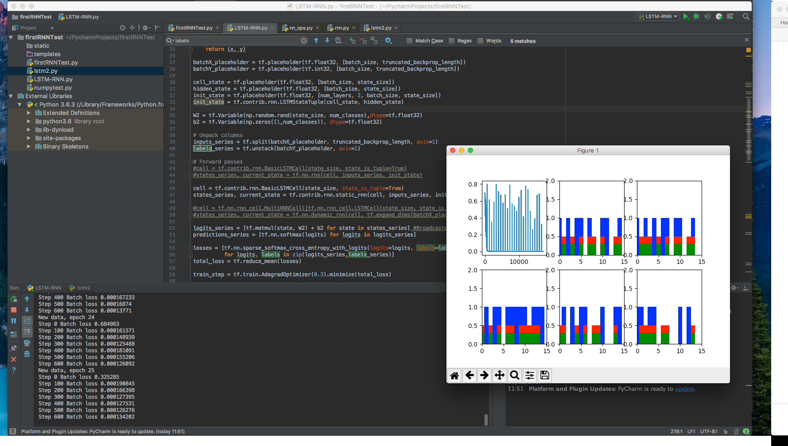
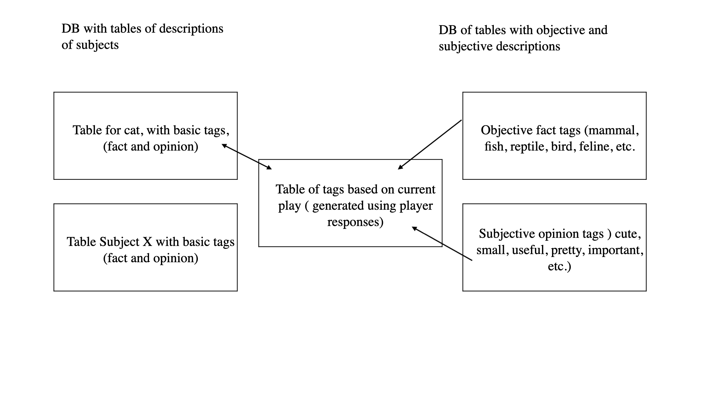

# RNN-LSTM-for-20-questions


This project was developed during my final year as a computer science student  at the university of Reading as part of my undergraduate reaserch theisis. 

This repo contains details of running the algorithm, expanding the dataset, and getting setup with the chatbot tools. 

## Using the Algorithm 

Using the algorithm requires you get setup with Python 2.7 and Anaconda to manage the variouse dependacies. A full list of requied tooling can be found [here](#tooling). 

First, make sure you have Python 2.7 and Anaconda installed, then install Tensorflow. 

From here, you should be able to run the algorithm by launching the `LSTM-RNN.py` in terminal. 

## Modifying the Algorithm

The most important parts of the algorithm are the weights, learning rate, number of cells, number of epoch and the input data. 

these are the values you would want to modify and play with: 

```
num_epochs = 10
total_series_length = 50000
truncated_backprop_length = 15
state_size = 4
num_classes = 2
echo_step = 3
batch_size = 5
num_batches = total_series_length//batch_size//truncated_backprop_length
num_layers = 3
```

pay close attention to these values:

```
num_epochs = 10
total_series_length = 50000
batch_size = 5
num_batches = total_series_length//batch_size//truncated_backprop_length
num_layers = 3
```

where `num_batches` detemins repitions. 

the `generateData` method supplied will generate a series of test data to show the algorithm working, which can be seen from the below screenshot:



You can tweak this method to play with the data generated:

```
def generateData():
    x = np.array(np.random.choice(2, total_series_length, p=[0.5, 0.5]))
    y = np.roll(x, echo_step)
    y[0:echo_step] = 0

    x = x.reshape((batch_size, -1))  # The first index changing slowest, subseries as rows
    y = y.reshape((batch_size, -1))

    return (x, y)
```

## Data

The data is the most important part of the algorithm, good, well tagged data is the goal of this. Taking basic input data, and refining it using `tags` generated by users on the fly. 



